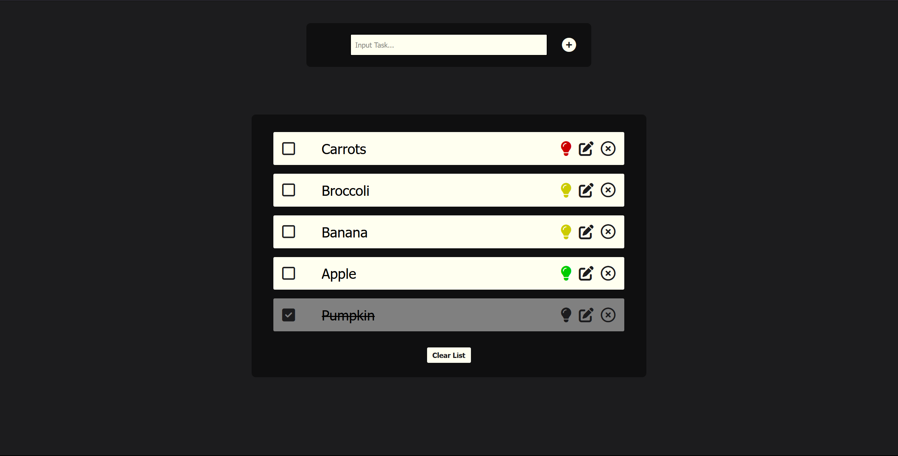

# To-Do

## Description
- This project contains a functions for adding, removing, editing To-Do notes while also utilizing the localstorage feature and displaying the saved tasks in a user friendly interface.
- 2024-02-24

## Visuals

## Installation
- Node.js is necessary to run this project. Download here: https://nodejs.org/en/download/current

- Clone this project to your preferred directory.

- Start terminal either in: Optional code editor, Windows Powershell, MacOS Terminal.app

- Navigate to the project directory: `cd To-Do`

- Install the project's required modules and dependencies, including Typescript: `npm install`

- Start the project by running the following command: `npm run dev`

- Copy the local path into a web browser, ex Google Chrome & Firefox

- Enjoy!

## Usage
This project includes the following components:
- Add: Create a new to-do task by writing a to-do title in the top inputbar and pressing enter on your keyboard or pressing the "+" button.
- Toggle: This button toggles the project between finished/unfinished.
- Priority: This button changes and sorts the priority of the task.
- Edit: This button activated the edit function making it possible to change the title of the task.
- Remove: This button removes the selected task.
- Clear all: This button deletes all saved tasks.

## Contact Information
- Github: https://github.com/L-Lifbom